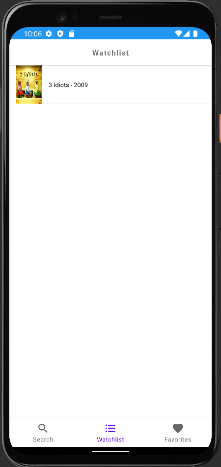

# MoApp

### Project Information

* You can login with your email and password.

* By searching on the search page, you can see the movie photo, movie name and movie date, and click on the one you want to go to the detail page.

* On the detail page, you can add the movie to favorites or watchlist. Then you can see the movie's name and photo in the watch list or favorites

___

#### Screenshots

           
   
    
   

